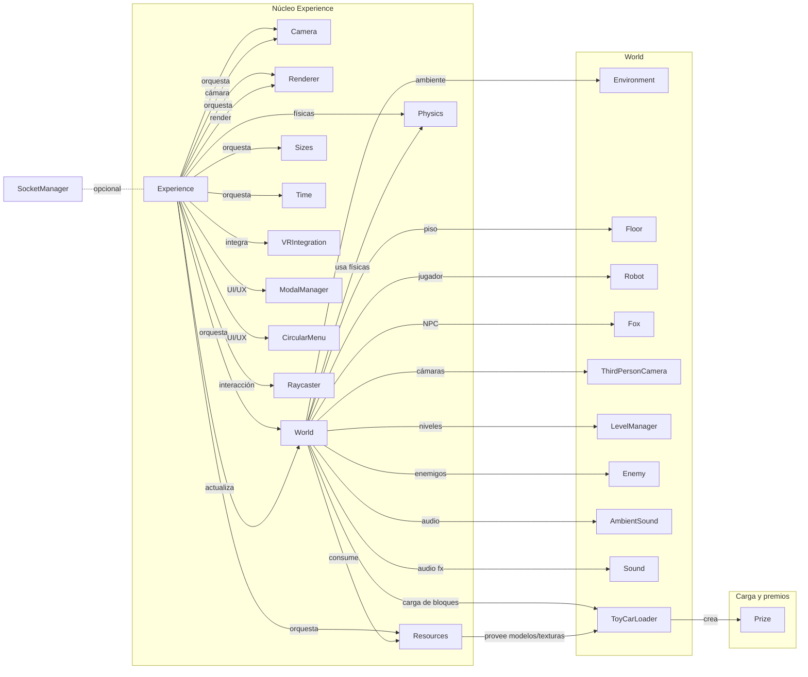

# Actividad Final Integrada (Momento 3)

Asignaturas: Programación Orientada a Entornos Multimedia + Ingeniería Web  
Modalidad: Trabajo en binas  
Tecnologías: React + Three.js + MongoDB + Blender  
Fecha: 13/11/2025

Autores (bina):
- Estudiante 1 — Usuario GitHub: @usuario1
- Estudiante 2 — Usuario GitHub: @usuario2

Repositorio del curso base: https://github.com/guswill24/Blender_Threejs_Mongo

---

## 0. Resumen ejecutivo
Este documento resume el desarrollo, decisiones técnicas y evidencias de la Actividad Final Integrada. El videojuego integra tres niveles creados en Blender, un sistema de puntuación y progreso, enemigos con IA básica, HUD informativo, físicas con Cannon-es, carga dinámica de escenarios y autenticación mediante JWT. Incluimos instrucciones de ejecución local, despliegue en Vercel (frontend) y lineamientos para el trabajo colaborativo con GitHub.

> Nota: Este README está diseñado con estructura “tipo documento Word” (secciones numeradas, checklist de evidencias y anexos) para facilitar su socialización y exportación.

---

## 1. Objetivo
Desarrollar, analizar y extender un videojuego interactivo a partir de una estructura funcional entregada, aplicando conceptos de programación multimedia, diseño 3D, gestión de recursos e integración de backend.

## 2. Finalidad
Fortalecer el pensamiento de arquitectura de software en un entorno tecnológico dinámico, integrando herramientas modernas sin perder criterio propio. Se prioriza comprender profundamente las soluciones implementadas (frontend, backend, 3D, físicas, autenticación) y evidenciar el trabajo colaborativo.

## 3. Tecnologías y herramientas
- Frontend: React + Three.js + Vite
- Backend: Node.js + Express + MongoDB (Atlas)
- 3D: Blender (exportación a GLB)
- Físicas: Cannon-es
- Autenticación: JSON Web Token (JWT)
- Hosting: Vercel (frontend)
- Colaboración: Git + GitHub

---

## 4. Arquitectura Global
Diagrama Mermaid (puede visualizarse en GitHub o en https://mermaid.live/):



---

## 5. Estructura de carpetas relevante
- `juegoFinal/Blender_Threejs_Mongo/backend/`
  - `app.js` — servidor Express; rutas montadas en `/api/blocks` y `/api/auth`
  - `controllers/` — `authController.js`, `blockController.js`
  - `models/` — `User.js`, `Block.js`
  - `routes/` — `authRoutes.js`, `blockRoutes.js`
  - `data/` — `toy_car_blocks.json`, `toy_car_blocks2.json`, `toy_car_blocks3.json`
  - Scripts: `seed-all-levels.js`, `seed.js`
- `juegoFinal/Blender_Threejs_Mongo/game-project/`
  - `public/data/toy_car_blocks.json` — dataset local para frontend standalone
  - `public/config/precisePhysicsModels.json` — físicas de malla precisa
  - `src/controls/CircularMenu.js` — HUD y menú
  - `src/loaders/ToyCarLoader.js` — carga de bloques y premios (coins)
  - `src/Experience/World/World.js` — lógica de niveles, puntos y enemigos
  - `src/Experience/World/Prize.js` — premio (coin) con role `default` y `finalPrize`

---

## 6. Backend: API y JWT
Base URL local por defecto: `http://localhost:3001`

- Autenticación (`/api/auth`):
  - `POST /register` — body: `{ username, email, password }`
  - `POST /login` — body: `{ email, password }`
  - `GET /ranking` — público
  - `GET /profile` — requiere `Authorization: Bearer <token>`
  - `PUT /score` — requiere `Authorization`, body: `{ score: number, level?: number }`
- Bloques (`/api/blocks`):
  - `GET /api/blocks?level=1` — devuelve bloques para el nivel
  - `POST /api/blocks` — crear un bloque (dev)
  - `POST /api/blocks/batch` — carga en lote desde JSON (dev)

Modelo `Block`:
- Campos: `name`, `x`, `y`, `z`, `level` (1..3), `role` (`default` | `finalPrize`)

Modelo `User`:
- Campos: `username`, `email`, `password`, `totalScore`, `levelsCompleted`  
- Hash de contraseña con `bcryptjs`; JWT configurable con `JWT_SECRET`

---

## 7. Desarrollo por actividades (qué, cómo, evidencias)

7.1 Niveles en Blender (3 niveles + coins)
- Qué: Diseño de 3 escenarios en Blender (assets de https://www.kenney.nl), exportación GLB y clasificación por nivel.
- Cómo (resumen técnico):
  - Exportación a GLB siguiendo: https://vitepress-multimedia.vercel.app/modules/configurar_escenario.html
  - Clasificación en JSON por `level` y `role` en: `backend/data/*.json` y/o `public/data/toy_car_blocks.json` (standalone).
- Evidencias (capturas obligatorias):
  - `docs/screenshots/blender-nivel1.png` (vista escena)
  - `docs/screenshots/blender-nivel2.png`
  - `docs/screenshots/blender-nivel3.png`

7.2 Teletransporte (portal/vórtice) entre niveles
- Qué: Portal que solo se activa cuando se recolectan todas las coins `role="default"` y muestra efectos (vórtice, luces, sonido).
- Cómo (en código):
  - Activación finalPrize en `World.js` al completar `getCurrentLevelTargetPoints()`.
  - Efectos con `FinalPrizeParticles` y focos (`SpotLight`) cuando aparece el `finalPrize`.
  - Progresión: `LevelManager.nextLevel()` o finalización de juego si no hay más niveles.
- Evidencias:
  - `docs/screenshots/portal-activo.png` (finalPrize visible con rayos/lights)

7.3 HUD (Frontend)
- Qué: Indicador de puntos por nivel y total; timer; contador de jugadores.
- Dónde: `game-project/src/controls/CircularMenu.js`.
- Cómo: `menu.setStatus('🎖️ Nivel X: N | Total: M')` y `setTimer(...)`.
- Evidencias:
  - `docs/screenshots/hud-nivel1.png`
  - `docs/screenshots/hud-nivel2.png`
  - `docs/screenshots/hud-nivel3.png`

7.4 Lógica de puntos (dinámica desde BD)
- Qué: Cantidad de coins por nivel definida por lectura desde backend (o fallback JSON local si no hay backend).
- Dónde: `ToyCarLoader.loadFromURL()/loadFromAPI()` y `World.loadLevel(level)`.
- Cómo: `GET /api/blocks?level=<n>` y conteo de `role="default"` frente a `getCurrentLevelTargetPoints()`.
- Evidencias:
  - `docs/screenshots/mongo-atlas-level1.png` (colección `blocks` con level=1)

7.5 Personaje, enemigo y coins
- Qué: Personaje principal con animaciones (FBX), IA de enemigos que siguen al jugador y cambian animaciones (correr/detenerse).  
  Enemigos por nivel: 1 (nivel 1), 3 (nivel 2), 5 (nivel 3).
- Dónde: `World.js` (`spawnEnemies`), `MainCharacter`, `Enemy`.
- Evidencias:
  - `docs/screenshots/enemigos-nivel1.png`
  - `docs/screenshots/enemigos-nivel2.png`
  - `docs/screenshots/enemigos-nivel3.png`

7.6 Esquemas visuales y carteles
- Qué: 4 carteles por nivel con imágenes temáticas.
- Dónde: `ToyCarLoader.js` (aplicación de texturas a meshes; ver matcher de `Cylinder`).
- Evidencias:
  - `docs/screenshots/carteles-nivel1.png`
  - `docs/screenshots/carteles-nivel2.png`
  - `docs/screenshots/carteles-nivel3.png`

7.7 JSON Web Token (acceso)
- Qué: Registro/Login y acceso autenticado para juego completo (backend). Frontend puede funcionar standalone (sin JWT) cuando se despliega solo en Vercel.
- Dónde: Backend `/api/auth`; middleware `backend/middleware/auth.js`.
- Evidencias:
  - `docs/screenshots/postman-register.png` (POST /api/auth/register)
  - `docs/screenshots/postman-login.png` (POST /api/auth/login)
  - `docs/screenshots/postman-profile.png` (GET /api/auth/profile con JWT)
  - `docs/screenshots/postman-score.png` (PUT /api/auth/score con JWT)

7.8 Publicación en Vercel (frontend) y trabajo colaborativo
- Qué: Publicar solo `game-project` en Vercel. Para modo standalone, actualizar `public/data/toy_car_blocks.json` con todos los niveles (sin endpoints).
- Evidencias:
  - `docs/screenshots/vercel-dashboard.png` (proyecto)
  - `docs/screenshots/vercel-app-running.png` (sitio público)
  - Historial colaborativo Git: `docs/screenshots/git-log.png`, `docs/screenshots/pull-request.png`

---

## 8. Instrucciones de instalación y ejecución (Windows PowerShell)

8.1 Backend (Express + MongoDB)

```powershell
# 1) Variables de entorno (.env)
# Crear archivo en: juegoFinal\Blender_Threejs_Mongo\backend\.env
# Contenido de ejemplo:
# MONGO_URI=mongodb+srv://<user>:<pass>@<cluster>/<db>?retryWrites=true&w=majority
# JWT_SECRET=super_secreto
# PORT=3001

# 2) Instalar dependencias y sembrar BD
cd "c:\Users\Lenovo\Desktop\Ucc\Multimedia\videojuegofinal1\juegoFinal\Blender_Threejs_Mongo\backend"
npm install
node seed-all-levels.js

# 3) Ejecutar backend
npm start
# App en http://localhost:3001 (rutas: /api/blocks, /api/auth)
```

8.2 Frontend (Vite + Three.js)

```powershell
cd "c:\Users\Lenovo\Desktop\Ucc\Multimedia\videojuegofinal1\juegoFinal\Blender_Threejs_Mongo\game-project"
npm install
npm run dev
# Abrir http://localhost:5173
```

8.3 Pruebas rápidas a la API (cURL / Postman)

```powershell
# Registro
curl -X POST http://localhost:3001/api/auth/register -H "Content-Type: application/json" -d '{"username":"demo","email":"demo@example.com","password":"secret123"}'

# Login (recibe token)
curl -X POST http://localhost:3001/api/auth/login -H "Content-Type: application/json" -d '{"email":"demo@example.com","password":"secret123"}'

# Perfil (requiere token)
# Reemplazar <TOKEN>
curl -X GET http://localhost:3001/api/auth/profile -H "Authorization: Bearer <TOKEN>"

# Bloques por nivel
curl -X GET "http://localhost:3001/api/blocks?level=2"
```

---

## 9. Despliegue en Vercel (solo frontend)

Pasos sugeridos:
1) Asegurar que `public/data/toy_car_blocks.json` contenga los 3 niveles para modo standalone.  
2) Crear proyecto en Vercel y conectar el repo (carpeta `game-project`).  
3) Build & output (por defecto Vite):  
   - Build Command: `npm run build`  
   - Output Directory: `dist`  
4) Variables opcionales: `VITE_BACKEND_URL` si se quiere consumir API en entorno público (requiere backend público).  
5) Probar la URL pública y tomar capturas.

---

## 10. Trabajo colaborativo (Git/GitHub)

- Flujo recomendado (ramas): `main` (estable), `dev` (integración), features por tarea (`feature/nivel-2`, `feature/jwt`, etc.).
- Commits claros por integrante (reglas de mensaje y referencia a issue/tarea).
- Pull Requests con revisión cruzada.

Comandos útiles (PowerShell):
```powershell
# Configuración básica
git status
git branch -vv

# Crear rama de feature
git checkout -b feature/nivel-2
# ... cambios ...
git add .
git commit -m "feat(levels): integra malla y coins nivel 2"
git push -u origin feature/nivel-2

# Crear Pull Request en GitHub y hacer merge a dev/main
```

Evidencias (obligatorias):
- `docs/screenshots/git-log.png` (historial)
- `docs/screenshots/pull-request.png` (PR)
- `docs/screenshots/merge.png` (merge)

---

## 11. Evidencias (checklist de capturas)

Colocar en `docs/screenshots/`:
- Blender (niveles): `blender-nivel1.png`, `blender-nivel2.png`, `blender-nivel3.png`
- HUD: `hud-nivel1.png`, `hud-nivel2.png`, `hud-nivel3.png`
- Portal activo: `portal-activo.png`
- Mongo Atlas: `mongo-atlas-level1.png`, `mongo-atlas-level2.png`, `mongo-atlas-level3.png`
- API Postman/cURL: `postman-register.png`, `postman-login.png`, `postman-profile.png`, `postman-score.png`
- Vercel: `vercel-dashboard.png`, `vercel-app-running.png`
- GitHub: `git-log.png`, `pull-request.png`, `merge.png`

---

## 12. Rúbrica (autoevaluación rápida)

- Implementación técnica general (Three.js + React + Experience): [ ] Excelente [ ] Bueno [ ] Aceptable [ ] Insuficiente
- Nuevos niveles integrados desde Blender: [ ] Excelente [ ] Bueno [ ] Aceptable [ ] Insuficiente
- Manejo de niveles + portal: [ ] Excelente [ ] Bueno [ ] Aceptable [ ] Insuficiente
- Lógica de puntuación/portal: [ ] Excelente [ ] Bueno [ ] Aceptable [ ] Insuficiente
- Configuración dinámica de premios (BD): [ ] Excelente [ ] Bueno [ ] Aceptable [ ] Insuficiente
- Trabajo colaborativo (GitHub): [ ] Excelente [ ] Bueno [ ] Aceptable [ ] Insuficiente
- Optimización HUD: [ ] Excelente [ ] Bueno [ ] Aceptable [ ] Insuficiente
- Precisión física (precisePhysicsModels.json): [ ] Excelente [ ] Bueno [ ] Aceptable [ ] Insuficiente
- Publicación en Vercel: [ ] Excelente [ ] Bueno [ ] Aceptable [ ] Insuficiente
- Socialización en clase: [ ] Excelente [ ] Bueno [ ] Aceptable [ ] Insuficiente
- Informe final (este documento + evidencias): [ ] Excelente [ ] Bueno [ ] Aceptable [ ] Insuficiente

---

## 13. Conclusiones (equipo)
- Aprendizajes clave:
- Decisiones técnicas más relevantes:
- Dificultades y cómo se resolvieron:
- Próximos pasos/mejoras sugeridas:

---

## 14. Anexos útiles
- `backend/app.js` — configuración CORS y rutas `/api`
- `backend/seed-all-levels.js` — siembra de niveles 1, 2 y 3
- `game-project/src/Experience/World/World.js` — puntuación, enemigos, transición de niveles y modal de fin de juego
- `game-project/src/controls/CircularMenu.js` — HUD (timer, puntos, jugadores, menú acciones)
- `game-project/src/loaders/ToyCarLoader.js` — carga de bloques/coins (API o JSON local), texturizado de carteles

---

## 15. Enlaces
- Base del curso: https://github.com/guswill24/Blender_Threejs_Mongo
- Guía exportación Blender → GLB: https://vitepress-multimedia.vercel.app/modules/configurar_escenario.html
- Vercel: https://vercel.com/
- Kenney assets: https://www.kenney.nl
